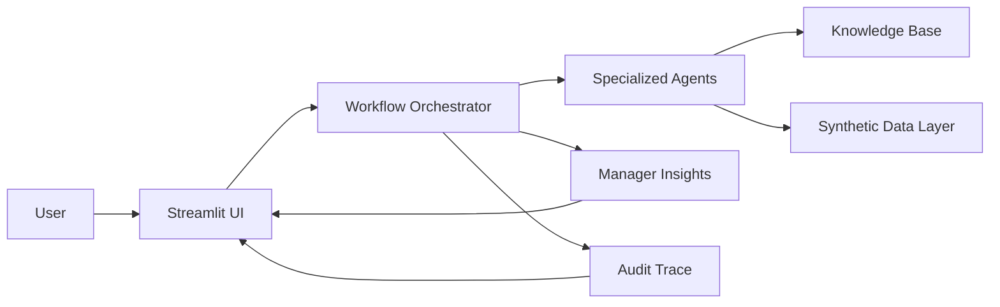
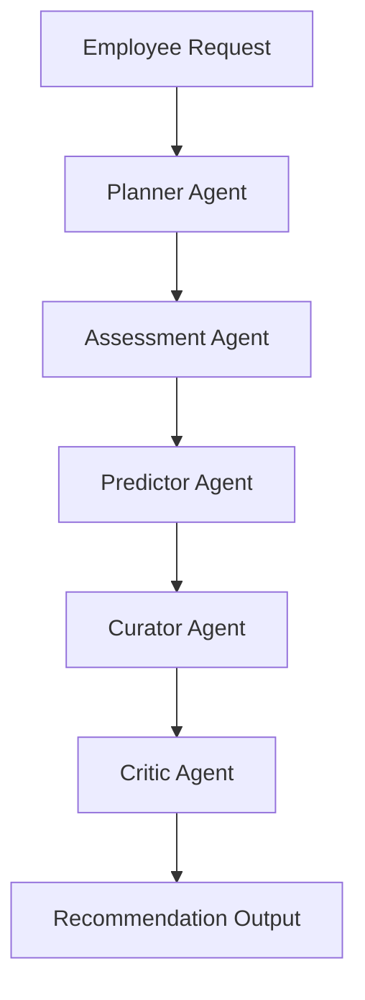

# Architecture

## Executive Summary

CertPilot X is a Streamlit-based multi-agent reasoning system for enterprise certification planning. The platform accepts an employee or manager request, routes it through specialized agents, grounds the workflow in synthetic knowledge and workload data, and returns explainable recommendations with trace output for judges and stakeholders.

## High-Level Architecture

## Component Breakdown

### Streamlit UI

The UI exposes three dashboards: Employee, Manager, and Agent Trace. It collects user inputs, displays KPI cards and charts, and renders trace and evaluation outputs.

### Core Layer

The core package holds typed dataclasses, configuration, validation, logging, telemetry, and tracing. This layer gives the app a stable contract surface and keeps the orchestration code focused on reasoning rather than plumbing.

### Data Layer

The synthetic data layer loads certification profiles, learner records, workload profiles, and evaluation cases from JSON files in `data/`. This keeps the demo reproducible and safe for hackathon use.

### Knowledge Layer

The knowledge folder contains certification guides and workload reports. These documents act as lightweight grounding material for the product narrative and future integration hooks.

### Orchestrator

The orchestrator coordinates the full request lifecycle, validates inputs, runs the agents in sequence, applies a self-reflection pass when needed, and assembles the final workflow result.

### Evaluation Layer

The evaluation runner replays synthetic test cases to produce evidence such as pass rate, confidence, readiness, and critic issues. This gives judges a deterministic way to inspect the solution.

## Agent Responsibilities

| Agent | Role |
| --- | --- |
| Curator Agent | Selects the certification path and explains the mapping from role to certification |
| Planner Agent | Builds the study plan across available weeks and allocates learning activities |
| Engagement Agent | Interprets meeting load and focus time to identify realistic study windows |
| Predictor Agent | Produces readiness and pass probability estimates with risk classification |
| Critic Agent | Validates the plan, checks prerequisites, and creates self-reflection notes |

## Mermaid Workflow Diagram

This sequence shows the interaction pattern requested for the hackathon diagram. The live implementation also includes workload-aware engagement logic and manager analytics around the core reasoning loop.

## Data Flow

1. The user provides role, certification, hours, and exam date through the Streamlit UI.
2. The orchestrator validates the request and initializes the workflow trace.
3. The Curator Agent resolves the certification pathway from the knowledge and data layer.
4. The Planner Agent creates a week-by-week plan.
5. The Engagement Agent adjusts recommendations around workload constraints.
6. The Predictor Agent estimates readiness and risk.
7. The Critic Agent reviews the output and records validation findings.
8. The manager insights engine aggregates the wider cohort and returns team-level analytics.

## Orchestrator Logic

The orchestrator is the control plane for the platform. It constructs agent instances, passes structured dataclass inputs between them, records each step in the audit trail, and stores a self-reflection note when the critic indicates a plan needs another pass. This pattern keeps the workflow explainable while remaining deterministic for the hackathon demo.

## Knowledge Layer Design

The knowledge layer is intentionally simple and portable:

- Certification guides capture role-to-certification mapping and required skills.
- Workload reports capture patterns such as meeting load and study window fit.
- Future grounding hooks in `core/integration_hooks.py` make it possible to connect Azure AI Foundry or MCP retrieval without reworking the UI or orchestration logic.

## Evaluation Framework

The evaluation framework uses synthetic test cases from `data/test_cases.json` and runs them through the same orchestrator used in production mode. The output includes:

- total cases executed
- pass rate
- average confidence
- average readiness
- number of critic issues found
- explanatory notes for failed or risky cases

This gives the submission repeatability and a simple way to demonstrate reliability.

## Scalability Considerations

- The current design isolates the UI, orchestration, data access, and evaluation layers so each can scale independently.
- The agent contract is typed, which makes future model substitution and testing simpler.
- The JSON-backed synthetic data layer can be swapped for an enterprise source without changing the user workflow.
- The trace and evaluation layers provide a strong base for observability and regression tracking.

## Security Considerations

- The repository uses synthetic data only.
- No secrets, employee records, or customer data are required to run the demo.
- Input validation guards the request contract before the orchestrator starts work.
- The architecture is ready for future secure grounding and identity-based integrations.

## Future Production Architecture

In a production deployment, CertPilot X could evolve into a hosted service with:

- Azure AI Foundry or MCP-backed grounding.
- Persistent datastore for learners, plans, and traces.
- Role-based authentication and tenant-aware access control.
- Background evaluation jobs and analytics export.
- Model routing for different agent tasks.
- Production logging, monitoring, and alerting.

The current repo already preserves the boundaries needed for that upgrade path.