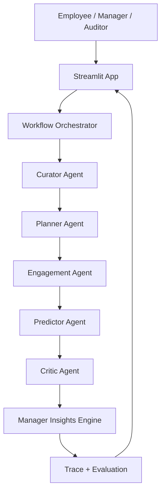

# Architecture

## Components

- Streamlit App: entry point for employee, manager, and trace dashboards.
- Workflow Orchestrator: coordinates the agent pipeline and records the audit trail.
- Curator Agent: resolves the certification path for a role.
- Planner Agent: builds the weekly study plan.
- Engagement Agent: suggests realistic study windows from workload signals.
- Predictor Agent: estimates readiness, pass probability, and risk.
- Critic Agent: validates realism and produces self-reflection notes.
- Manager Insights Engine: aggregates team readiness, coverage, and skill gaps.
- Evaluation Runner: executes synthetic test cases for demo evidence.

## Data Flow

1. The user enters role, workload, and exam timing in the Streamlit app.
2. The orchestrator runs the five-agent workflow on synthetic data.
3. The manager insights engine computes team-wide analytics from the same data sources.
4. The evaluation runner replays synthetic cases to produce evidence for judges.